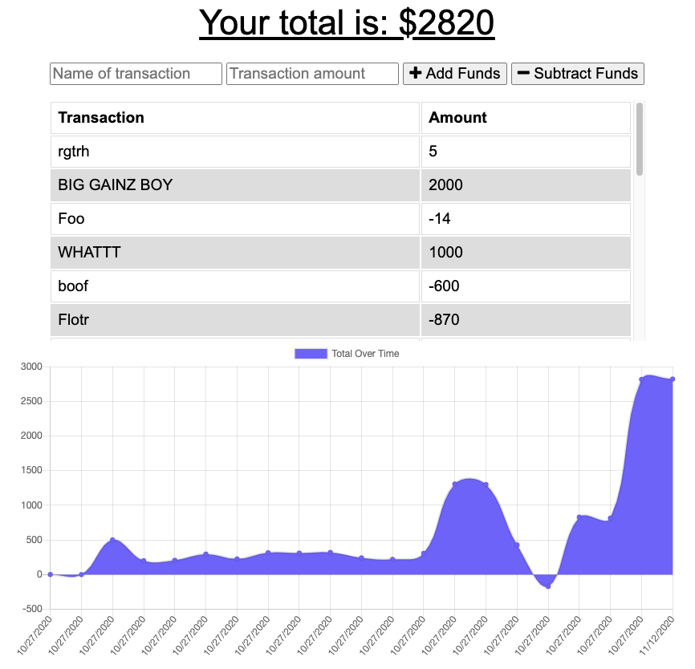
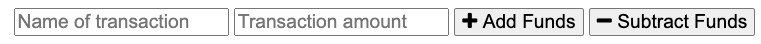
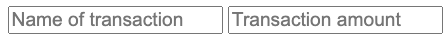
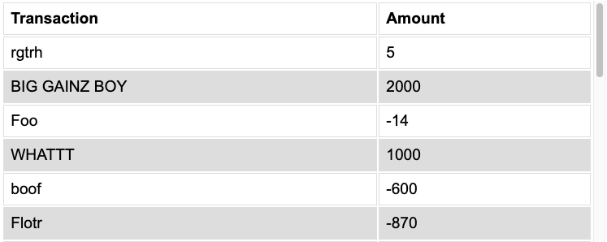
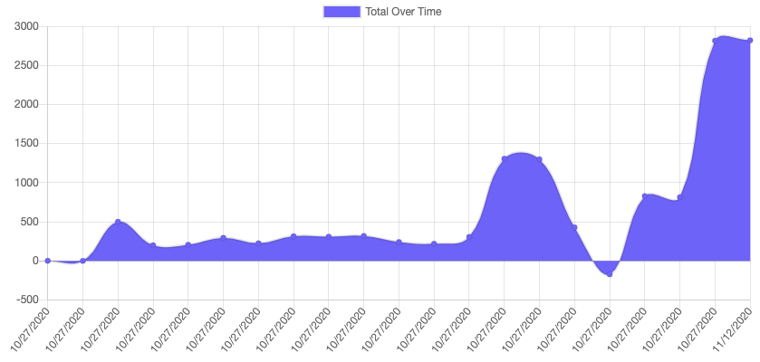

# Budget Tracker

## Track your expenses, even offline!

[Click Here to try it for yourself](https://sleepy-ocean-36844.herokuapp.com/)

### You'll be greeted with this page upon entering the app

### The top number tells you your current budget balance.

### Beneath that area, you'll find the Transaction Field.

### Start by entering the name of a transaction, and the amount.

### Then select whether you are adding or subtracting money from your balance.

### It will be added to your list of transactions.

### How your balance has changed over time will be displayed in the graph below.

